# Architecture Design - AWS S3 Terraform Module

**Document Version**: 1.0  
**Date**: 2025-06-30  
**Module**: terraform-aws-s3  
**AWS Provider**: ~> 6.0  
**GitHub Issue**: [#4](https://github.com/hashi-demo-lab/terraform-aws-s3/issues/4)

## Executive Summary

This document outlines the comprehensive architecture design for the terraform-aws-s3 module, incorporating security-first principles, AWS provider best practices, and lessons learned from the popular terraform-aws-modules/s3-bucket module. The design prioritizes security, compliance, and ease of use while maintaining flexibility for diverse use cases.

## Architecture Overview

### Design Philosophy

1. **Security by Default**: All security-sensitive settings default to secure configurations
2. **Separation of Concerns**: Use dedicated resources instead of deprecated inline arguments
3. **Modular Design**: Feature toggles allow users to enable/disable functionality
4. **Comprehensive Validation**: Extensive input validation to prevent misconfigurations
5. **Clear Dependencies**: Explicit resource dependencies for predictable operation order

### Resource Architecture

```mermaid
graph TB
    subgraph "Core Module"
        A[aws_s3_bucket] --> B[aws_s3_bucket_public_access_block]
        A --> C[aws_s3_bucket_server_side_encryption_configuration]
        A --> D[aws_s3_bucket_versioning]
        A --> E[aws_s3_bucket_logging]
    end
    
    subgraph "Optional Features"
        A --> F[aws_s3_bucket_lifecycle_configuration]
        A --> G[aws_s3_bucket_cors_configuration]
        A --> H[aws_s3_bucket_website_configuration]
        A --> I[aws_s3_bucket_notification]
        A --> J[aws_s3_bucket_replication_configuration]
        A --> K[aws_s3_bucket_object_lock_configuration]
        A --> L[aws_s3_bucket_policy]
    end
    
    subgraph "Supporting Resources"
        M[aws_kms_key] --> C
        N[aws_iam_role] --> J
        O[aws_s3_bucket - target] --> E
    end
```



## Module Structure

### File Organization

```
terraform-aws-s3/
├── main.tf                    # Core bucket resource
├── security.tf               # Security configurations (encryption, public access block)
├── features.tf               # Feature resources (lifecycle, CORS, website, etc.)
├── policies.tf               # IAM and bucket policies
├── variables.tf              # Input variables with validation
├── outputs.tf                # Module outputs
├── locals.tf                 # Local value computations
├── versions.tf               # Provider and Terraform version requirements
├── examples/                 # Usage examples
│   ├── basic/               # Simple bucket with security defaults
│   ├── secure/              # Enhanced security configuration
│   ├── website/             # Static website hosting
│   ├── logging/             # Centralized logging setup
│   └── complete/            # All features enabled
├── tests/                   # Automated testing
│   ├── unit/               # Unit tests
│   └── integration/        # Integration tests
└── docs/                   # Documentation
    ├── security-guide.md   # Security configuration guidance
    └── migration-guide.md  # Migration from other modules
```

## Resource Design Specifications

### 1. Core Bucket Resource (main.tf)

```hcl
resource "aws_s3_bucket" "this" {
  count = var.create_bucket ? 1 : 0

  bucket        = var.bucket
  bucket_prefix = var.bucket_prefix
  
  # Security: Enable Object Lock if specified
  object_lock_enabled = var.object_lock_enabled
  
  # Force destroy only if explicitly enabled
  force_destroy = var.force_destroy

  tags = merge(
    var.tags,
    var.default_tags,
    {
      Module = "terraform-aws-s3"
      ManagedBy = "Terraform"
    }
  )

  lifecycle {
    prevent_destroy = true
    ignore_changes = [
      # Ignore these as they're managed by separate resources
      server_side_encryption_configuration,
      versioning,
      logging,
      lifecycle_rule,
      cors_rule,
      website,
      policy
    ]
  }
}
```

### 2. Security Resources (security.tf)

#### Public Access Block (Mandatory)
```hcl
resource "aws_s3_bucket_public_access_block" "this" {
  count = var.create_bucket ? 1 : 0

  bucket = aws_s3_bucket.this[0].id

  # Security defaults - all public access blocked
  block_public_acls       = var.block_public_acls
  block_public_policy     = var.block_public_policy
  ignore_public_acls      = var.ignore_public_acls
  restrict_public_buckets = var.restrict_public_buckets

  depends_on = [aws_s3_bucket.this]
}
```

#### Server-Side Encryption (Mandatory)
```hcl
resource "aws_s3_bucket_server_side_encryption_configuration" "this" {
  count = var.create_bucket ? 1 : 0

  bucket = aws_s3_bucket.this[0].id

  rule {
    apply_server_side_encryption_by_default {
      sse_algorithm     = var.sse_algorithm
      kms_master_key_id = var.kms_master_key_id
    }
    bucket_key_enabled = var.bucket_key_enabled
  }

  depends_on = [aws_s3_bucket.this]
}
```

#### Versioning Configuration
```hcl
resource "aws_s3_bucket_versioning" "this" {
  count = var.create_bucket && var.enable_versioning ? 1 : 0

  bucket = aws_s3_bucket.this[0].id
  
  versioning_configuration {
    status     = var.versioning_status
    mfa_delete = var.versioning_mfa_delete
  }

  depends_on = [aws_s3_bucket.this]
}
```

### 3. Feature Resources (features.tf)

#### Logging Configuration
```hcl
resource "aws_s3_bucket_logging" "this" {
  count = var.create_bucket && var.enable_logging ? 1 : 0

  bucket = aws_s3_bucket.this[0].id

  target_bucket = var.logging_target_bucket
  target_prefix = var.logging_target_prefix

  depends_on = [aws_s3_bucket.this]
}
```

#### Lifecycle Configuration
```hcl
resource "aws_s3_bucket_lifecycle_configuration" "this" {
  count = var.create_bucket && length(var.lifecycle_rules) > 0 ? 1 : 0

  bucket = aws_s3_bucket.this[0].id

  dynamic "rule" {
    for_each = var.lifecycle_rules
    content {
      id     = rule.value.id
      status = rule.value.status

      # Dynamic blocks for transitions, expirations, etc.
      dynamic "transition" {
        for_each = lookup(rule.value, "transitions", [])
        content {
          days          = transition.value.days
          storage_class = transition.value.storage_class
        }
      }

      # Additional lifecycle configurations...
    }
  }

  depends_on = [aws_s3_bucket_versioning.this]
}
```

## Variable Design

### Security Variables (Secure Defaults)

```hcl
variable "block_public_acls" {
  description = "Whether Amazon S3 should block public ACLs for this bucket"
  type        = bool
  default     = true
}

variable "block_public_policy" {
  description = "Whether Amazon S3 should block public bucket policies for this bucket"
  type        = bool
  default     = true
}

variable "ignore_public_acls" {
  description = "Whether Amazon S3 should ignore public ACLs for this bucket"
  type        = bool
  default     = true
}

variable "restrict_public_buckets" {
  description = "Whether Amazon S3 should restrict public bucket policies for this bucket"
  type        = bool
  default     = true
}

variable "sse_algorithm" {
  description = "Server-side encryption algorithm to use"
  type        = string
  default     = "AES256"
  
  validation {
    condition     = contains(["AES256", "aws:kms", "aws:kms:dsse"], var.sse_algorithm)
    error_message = "SSE algorithm must be one of: AES256, aws:kms, aws:kms:dsse."
  }
}
```

### Feature Toggle Variables

```hcl
variable "enable_versioning" {
  description = "Enable bucket versioning"
  type        = bool
  default     = false
}

variable "enable_logging" {
  description = "Enable bucket access logging"
  type        = bool
  default     = false
}

variable "enable_lifecycle" {
  description = "Enable lifecycle configuration"
  type        = bool
  default     = false
}

variable "enable_cors" {
  description = "Enable CORS configuration"
  type        = bool
  default     = false
}

variable "enable_website" {
  description = "Enable static website hosting"
  type        = bool
  default     = false
}

variable "enable_replication" {
  description = "Enable cross-region replication"
  type        = bool
  default     = false
}
```

### Complex Configuration Variables

```hcl
variable "lifecycle_rules" {
  description = "List of lifecycle rules for the bucket"
  type = list(object({
    id     = string
    status = string
    transitions = optional(list(object({
      days          = number
      storage_class = string
    })), [])
    expiration = optional(object({
      days = number
    }))
    noncurrent_version_transitions = optional(list(object({
      days          = number
      storage_class = string
    })), [])
    noncurrent_version_expiration = optional(object({
      days = number
    }))
  }))
  default = []
}

variable "cors_rules" {
  description = "List of CORS rules for the bucket"
  type = list(object({
    allowed_headers = optional(list(string), [])
    allowed_methods = list(string)
    allowed_origins = list(string)
    expose_headers  = optional(list(string), [])
    max_age_seconds = optional(number)
  }))
  default = []
}
```

## Output Design

### Core Outputs

```hcl
output "bucket_id" {
  description = "The name of the bucket"
  value       = try(aws_s3_bucket.this[0].id, null)
}

output "bucket_arn" {
  description = "The ARN of the bucket"
  value       = try(aws_s3_bucket.this[0].arn, null)
}

output "bucket_domain_name" {
  description = "The bucket domain name"
  value       = try(aws_s3_bucket.this[0].bucket_domain_name, null)
}

output "bucket_regional_domain_name" {
  description = "The bucket region-specific domain name"
  value       = try(aws_s3_bucket.this[0].bucket_regional_domain_name, null)
}
```

### Security Outputs

```hcl
output "bucket_encryption" {
  description = "The bucket encryption configuration"
  value = try({
    sse_algorithm     = aws_s3_bucket_server_side_encryption_configuration.this[0].rule[0].apply_server_side_encryption_by_default[0].sse_algorithm
    kms_master_key_id = aws_s3_bucket_server_side_encryption_configuration.this[0].rule[0].apply_server_side_encryption_by_default[0].kms_master_key_id
    bucket_key_enabled = aws_s3_bucket_server_side_encryption_configuration.this[0].rule[0].bucket_key_enabled
  }, null)
}

output "public_access_block" {
  description = "The bucket public access block configuration"
  value = try({
    block_public_acls       = aws_s3_bucket_public_access_block.this[0].block_public_acls
    block_public_policy     = aws_s3_bucket_public_access_block.this[0].block_public_policy
    ignore_public_acls      = aws_s3_bucket_public_access_block.this[0].ignore_public_acls
    restrict_public_buckets = aws_s3_bucket_public_access_block.this[0].restrict_public_buckets
  }, null)
}
```

## Security Controls Matrix

| Control | Implementation | Default | Configurable | tfsec Rule |
|---------|---------------|---------|--------------|------------|
| Encryption | `aws_s3_bucket_server_side_encryption_configuration` | AES256 | ✅ | aws-s3-enable-bucket-encryption |
| Public Access Block | `aws_s3_bucket_public_access_block` | All blocked | ✅ | aws-s3-*-public-* |
| Versioning | `aws_s3_bucket_versioning` | Disabled | ✅ | aws-s3-enable-versioning |
| Logging | `aws_s3_bucket_logging` | Disabled | ✅ | aws-s3-enable-bucket-logging |
| Object Lock | `aws_s3_bucket_object_lock_configuration` | Disabled | ✅ | N/A |
| KMS Encryption | Support via `kms_master_key_id` | None | ✅ | aws-s3-kms-encrypted-by-default |

## Usage Examples

### Basic Secure Bucket

```hcl
module "s3_bucket" {
  source = "./terraform-aws-s3"

  bucket = "my-secure-bucket"
  
  # Security is enabled by default
  # All public access blocked by default
  # AES256 encryption enabled by default
  
  tags = {
    Environment = "production"
    Owner       = "platform-team"
  }
}
```

### Enhanced Security with KMS

```hcl
module "s3_bucket_kms" {
  source = "./terraform-aws-s3"

  bucket = "my-kms-encrypted-bucket"
  
  # Enhanced encryption
  sse_algorithm     = "aws:kms"
  kms_master_key_id = aws_kms_key.s3.arn
  
  # Enable versioning for data protection
  enable_versioning = true
  versioning_status = "Enabled"
  
  # Enable logging
  enable_logging           = true
  logging_target_bucket    = "my-access-logs-bucket"
  logging_target_prefix    = "access-logs/"
  
  tags = {
    Environment = "production"
    Compliance  = "required"
  }
}
```

### Complete Configuration

```hcl
module "s3_bucket_complete" {
  source = "./terraform-aws-s3"

  bucket = "my-complete-bucket"
  
  # Security
  sse_algorithm     = "aws:kms"
  kms_master_key_id = aws_kms_key.s3.arn
  enable_versioning = true
  
  # Lifecycle management
  enable_lifecycle = true
  lifecycle_rules = [
    {
      id     = "complete_lifecycle"
      status = "Enabled"
      transitions = [
        {
          days          = 30
          storage_class = "STANDARD_IA"
        },
        {
          days          = 60
          storage_class = "GLACIER"
        }
      ]
      expiration = {
        days = 365
      }
    }
  ]
  
  # CORS for web applications
  enable_cors = true
  cors_rules = [
    {
      allowed_methods = ["GET", "POST"]
      allowed_origins = ["https://example.com"]
      allowed_headers = ["*"]
      max_age_seconds = 3000
    }
  ]
  
  tags = {
    Environment = "production"
    Application = "web-app"
  }
}
```

## Testing Strategy

### Unit Tests
- Variable validation testing
- Resource dependency verification
- Default value confirmation
- Error condition handling

### Integration Tests
- Real AWS deployment testing
- Security scanner integration (tfsec, checkov)
- Cross-region replication testing
- KMS key integration testing

### Security Tests
- Public access prevention verification
- Encryption configuration validation
- Policy attachment testing
- Compliance framework alignment

## Migration Strategy

### From aws_s3_bucket Inline Arguments
1. Identify deprecated inline arguments
2. Map to new dedicated resources
3. Provide migration examples
4. Document breaking changes

### From Other Modules
1. Variable mapping documentation
2. Output structure comparison
3. Feature parity analysis
4. Migration automation scripts

## Performance Considerations

### Resource Dependencies
- Explicit dependencies prevent race conditions
- Parallel resource creation where possible
- Minimal API calls through efficient resource design

### State Management
- Lifecycle rules prevent accidental destruction
- Ignore changes for externally managed attributes
- Efficient plan/apply cycles

## Compliance Framework

### Security Frameworks
- ✅ AWS Well-Architected Security Pillar
- ✅ NIST Cybersecurity Framework
- ✅ PCI-DSS Requirements
- ✅ HIPAA Security Rule
- ✅ SOC 2 Type II

### Governance Requirements
- Mandatory tagging strategy
- Cost allocation support
- Audit trail maintenance
- Change management integration

## Next Steps

1. **Implementation Phase**
   - Create file structure
   - Implement core resources
   - Add variable validation
   - Create basic examples

2. **Testing Phase**
   - Unit test implementation
   - Integration test setup
   - Security scanner integration
   - Performance testing

3. **Documentation Phase**
   - User documentation
   - Security guide
   - Migration documentation
   - Example scenarios

4. **Review and Iteration**
   - Security review
   - Performance optimization
   - User feedback incorporation
   - Production readiness validation

---

*This architecture design serves as the blueprint for implementing the terraform-aws-s3 module. All implementation decisions should align with the principles and specifications outlined in this document.*